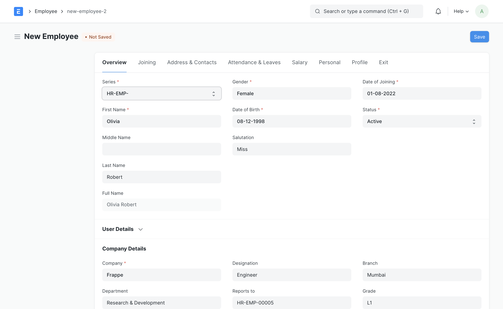
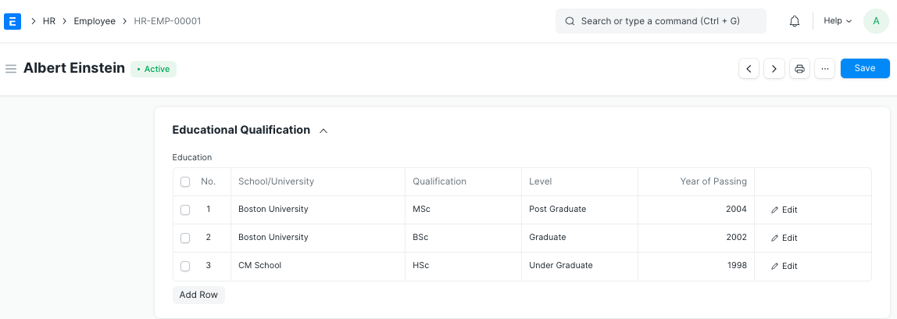
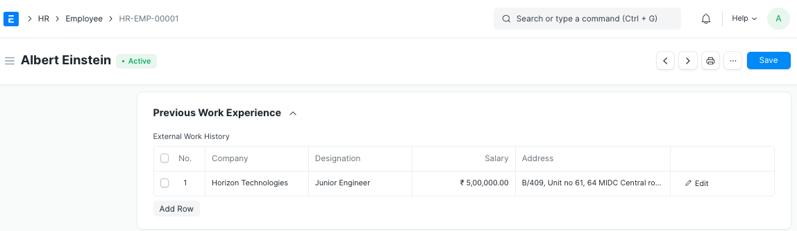

.. _execute-package:

===================
Employee Management
===================

An individual who works part-time or full-time under a contract of employment, and has recognized rights and duties of your company is your Employee. When an applicant has signed the employment contract, basic and employment details of the employee should be captured in the system. To register a new employee, go to Newright-click it and hit ***Execute***

Once the Employee status is set to **Left**, that particular Employee master will not be accessible in further transactions.
.. note::

	To access the Employee master, go to:
		> Home > Human Resources > Employee

.. note::

    * To access the Employee master, go to: > Home > Human Resources > Employee 
 
* **Prerequisites**

Before creating an Employee, it is advised to create the following:

* :ref:`Employee Types <employment-type>`
* :ref:`Department <department>`
* :ref:`Employee Grade <employee-grade>`
* :ref:`Branch <branch>`
* :ref:`Designation <designation>` 
* :ref:`Leave Policy <leave-policy>` 

How to create an Employee
-------------------------

1. Go to the Employee list, click on New.
1. Enter the Employee's personal details such as Name, Gender, Date of Birth, and Date of Joining.
1. Save.

As shown below, all the mandatory fields are highlighted.

Features
--------

Apart from the aforementioned mandatory details, some additional details that can be captured in the Employee master are as follows:

- **Employment Type**

You can set an `Employee Types <employment-type>` such as Intern, Contract, Full-time, Part-time, Probation, etc. for an Employee.

- **Joining Details**

The Joining Details of the Employee such as the Offer Date, Confirmation Date, Contract End Date, Notice (Days), and Date of Retirement can be captured.

- **Department and Grade**

In a company, the Employees are usually grouped on the basis of `Department <department>`. In the Department and Grade section, these details of the Employee can be saved. In the **Reports to** field, the person to whom the Employee has to report his duties to can be captured.

- **Leave Details**

In Leave Details, you can save the :ref:`Leave Policy <leave-policy>` and :ref:`Holiday List <holiday-list>`  details. Leave Policy specifies the type and number of leaves an Employee is entitled to, and Holiday List is a list which contains the dates of holidays and weekly offs.

- **Salary Details**

Here, the mode of salary payment, i.e. through Bank, Cheque or Cash can be selected.

- **Contact Details**

Employee's Contact information such as Mobile Number, Current and Permanent Address, Personal and Company Email ID can be captured here. In the Preferred Email ID field, either the the Company Email, Personal Email or User ID of the Employee can be selected depending on the user's preference.

- **Personal Details**

Personal Details of the Employee such as Family Background details like name and occupation of parent, spouse and children, Passport Details including date and place of issue, Health Details like height, weight, allergies, medical concerns, etc. can be saved.

- **Educational Qualification**

Here, the Educational Details such as School/University, Qualification, Level and Year of Passing of the Employee can be saved as shown below:
 

- **Previous Work Experience**

Just like Educational Qualification, an Employee's Previous Work Experience can also be captured in the External Work History table as shown below:
 

Additionally, details such as Contact of the previous company and Total Experience in years can also be saved in the External Work History table.

- **Exit**

Exit details of the employee (if any) such as Resignation and Exit Interview can be saved. When the status of the Employee is set to **Left**, it is mandatory to fill the Relieving Date.

.. note::

    * Once the Employee status is set to **Left**, that particular Employee master will not be accessible in further transactions.
   
- **Additional Features**
Some additional features included in the Employee master are as follows:

* Emergency Contact
* Health Insurance
* Personal Bio
* History in the Company