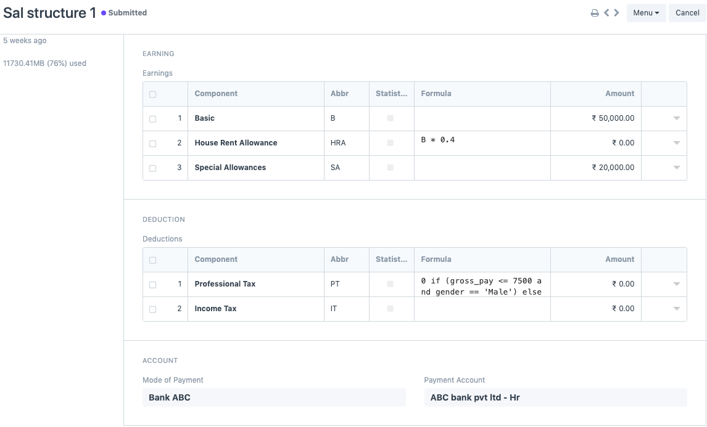
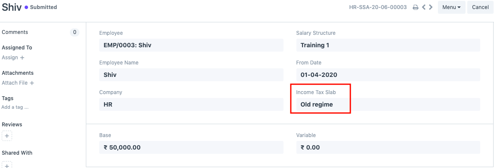
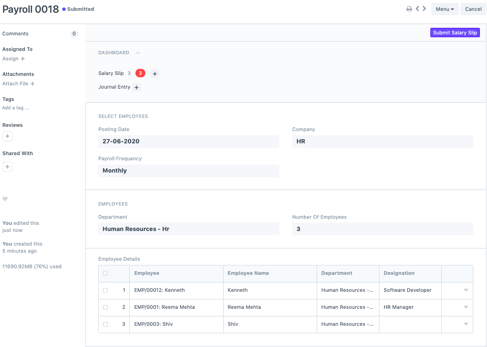
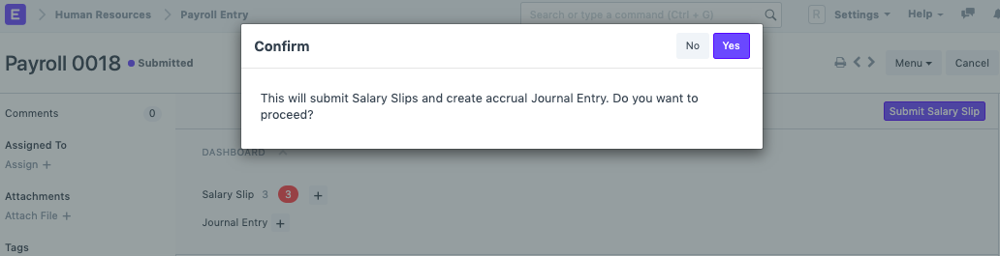
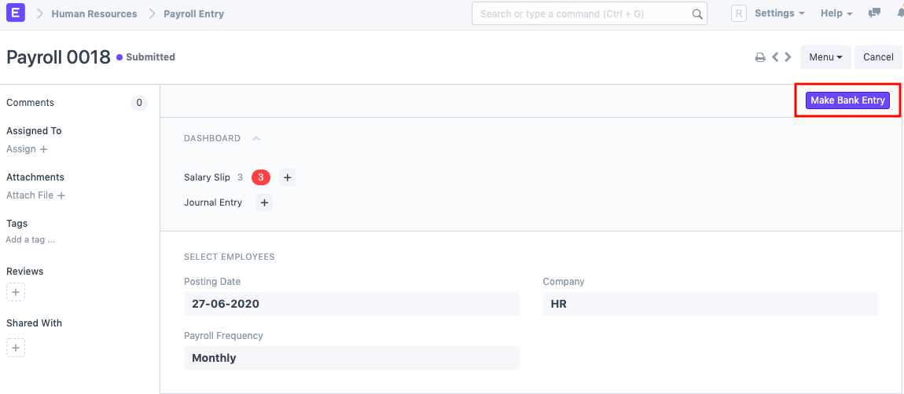

==================
Payroll Management
==================

Processing payroll of employees can be cumbersome and a time-consuming activity taking into account the financial and legal implications. Changes in tax, employee regulations, and legal compliances can make payroll processing a painfully complex task. Being one of the most important tasks carried out in an organisation, it is significant to ensure that there are no challenges in the process.

Challenges of Processing Payroll
================================

As your organization grows and employees start to step in and out of your team, HR management can become difficult. Some common challenges of processing payroll are

* Compliance
* Accuracy
* Tax Regulations
* Employee Data management
* Security
* Managing changes based on evolving conditions (for example, the amount of Income Tax to be deducted changing across financial years)

Sigma's 5 Step Payroll
========================

Step 1: Define Payroll Period
-----------------------------

The period for which payroll entries have to be made is defined as Payroll Period. Additionally, if you want the system to calculate taxable amounts automatically, then you must define the taxable salary slabs. You can also declare the maximum tax exemption amount applicable in this period. 

Step 2: Define Salary Components
--------------------------------

The salaries that are offered to employees involve various components ranging from basic, House Rent Allowance (HRA), Professional Tax (PT), and so on. A salary component either be an **Earning** or a **Deduction** based on how it is defined. You can add the amount directly or it can be an amount calculated on the basis of base salary or a particular rate or based on a formula involving the other components as well.

You can create salary components and define whether the component is an Earning or a Deduction component. There are certain checkboxes that you can check depending on the component type. Select the company and a default ledger account. Now, these salary components can be based on a particular formula or it can be a fixed amount. Only for Income Tax component you need to check a particular checkbox called "Variable based on Taxable Salary". This will ensure that the Income Tax is calculated automatically in the backend.

Step 3: Create a Salary Structure
---------------------------------
Once you have created all the salary components, you can define a salary structure. You can also define whether the salary is based on timesheets. You can add the earnings and deductions as per your choice and the mode of payment.

Salary Structure represents how salaries are created in SIGMA based on earnings and deductions. In simple words, it is the breakup of the salary offered to your employees. Creation of salary structures in SIGMA requires you to first create Salary Components.

Step 4. Assign the Salary Structure
-----------------------------------

Once the salary structures have been created, you need to assign it to employees. If you miss this step, then you will not be able to proceed further. During assignment, you have to select the Income Tax Slab (if you have multiple slabs), since the percentage deduction of Income Tax will be calculated based on the same. You can also define a base amount if your salary structures are based on formulas.

Step 5. Create a Payroll Entry & Salary Slips
---------------------------------------------

Once all of the above steps are done, you need to create a payroll entry. Once you have selected the payroll date, frequency and added the payment account, you can filter employees on the basis on department, designation and branch. If you do not wish to do so then you can directly click on 'Get employees'. On doing so, a list of all the employees will populate in the Employee Details section. You can then proceed by clicking on "Create Salary Slips" and all the salary slips will be generated in draft.

You can verify the draft salary slips and then submit them via the payroll entry. On submitting the salary slips, an accrual journal entry will be created. This means we are booking the salary expenses in the system and not paying them.

Step 6. Bank Entry
------------------

Once you have booked the accrued salary slips, as a last step you need to make a Bank Entry. With this last step, your payroll process is completed, but this does not mean the salaries are transferred in the bank. That minor step has to be done manually.

