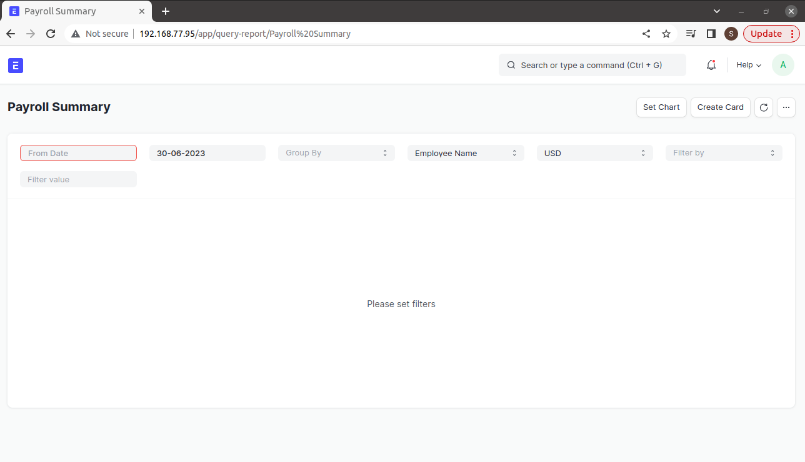
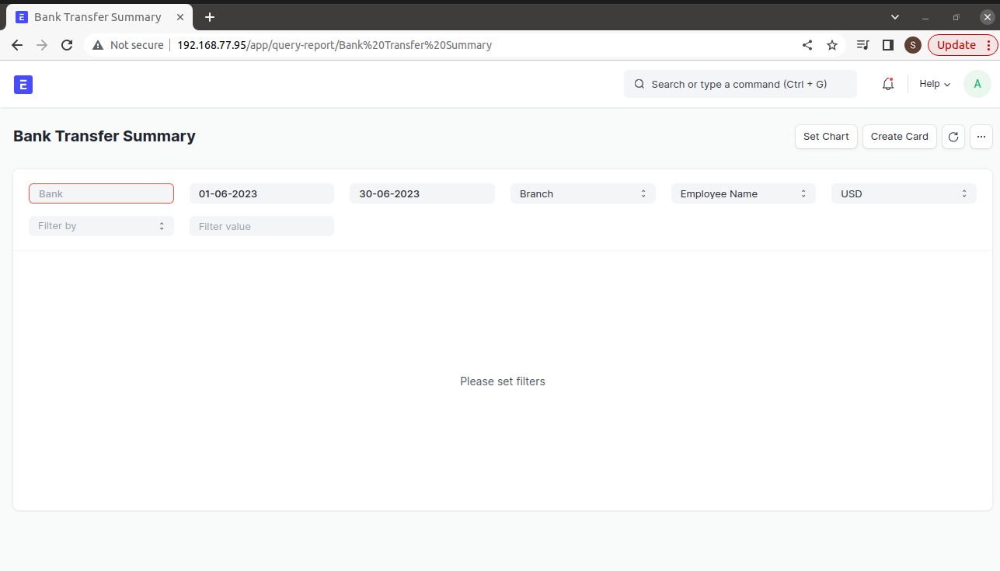

===============
Payroll Reports
===============

Once Salary Slips have been generated, it is time to check on how figures for each employee look like. There are 3 major reports that you can check. These are

#. Payroll Summary
#. Bank Transfer Summary
#. Cash Payment Summary

.. note::
	To access the payroll reports, go to: > Home > Payroll  

Payroll Summary Report
======================

- This report displays all salary components (earnings/deductions) for employees for a certain payroll period. It will display all values for the salary components in different columns. This is the payroll master report
- The report can be queried using different parameters as below:

	- **Start Date**. Specifies period start date for which you want to view the payroll
	- **End Date**. Specifies period start date for which you want to view the payroll
	- **Group By**. Determines how the payroll summary report will be organized or grouped. Available options are Branch, Department and Employement Type
	- **Sort By**. Determines the field to be used to sort the payroll summary report. Available options are Employee Number, Employee Name and Net Pay
	- **Reporting Currency**. Specifies the currency in which you want to view the payroll. Available options are USD and SSP
	- **Filter By**. Provides an option to show payroll summary for different branch and departments. This field specifies the category you want to filter by
	- **Filter Value**. Provides the value of Branch or Department whose payroll you want to preview

 
Bank Transfer Summary Report
============================

- This report shows summaries for employees whose salary is paid through the bank. It allows for drill down just like the Payroll summary report.

	- **Start Date**. Specifies period start date for which you want to view the payroll
	- **End Date**. Specifies period start date for which you want to view the payroll
	- **Group By**. Determines how the payroll summary report will be organized or grouped. Available options are Branch, Department and Employement Type
	- **Sort By**. Determines the field to be used to sort the payroll summary report. Available options are Employee Number, Employee Name and Net Pay
	- **Reporting Currency**. Specifies the currency in which you want to view the payroll. Available options are USD and SSP
	- **Filter By**. Provides an option to show payroll summary for different branch and departments. This field specifies the category you want to filter by
	- **Filter Value**. Provides the value of Branch or Department whose payroll you want to preview

Cash Payment Summary Report
===========================

- This report shows summaries for employees whose salary is paid through in cash. It allows for drill down just like the Payroll summary report.

	- **Start Date**. Specifies period start date for which you want to view the payroll
	- **End Date**. Specifies period start date for which you want to view the payroll
	- **Group By**. Determines how the payroll summary report will be organized or grouped. Available options are Branch, Department and Employement Type
	- **Sort By**. Determines the field to be used to sort the payroll summary report. Available options are Employee Number, Employee Name and Net Pay
	- **Reporting Currency**. Specifies the currency in which you want to view the payroll. Available options are USD and SSP
	- **Filter By**. Provides an option to show payroll summary for different branch and departments. This field specifies the category you want to filter by
	- **Filter Value**. Provides the value of Branch or Department whose payroll you want to preview

.. image::  ../_static/images/hr/cash_payment_summary.png
	:width: 600
	:alt: Cash Payment Summary
